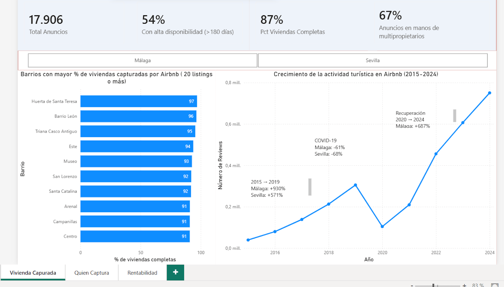
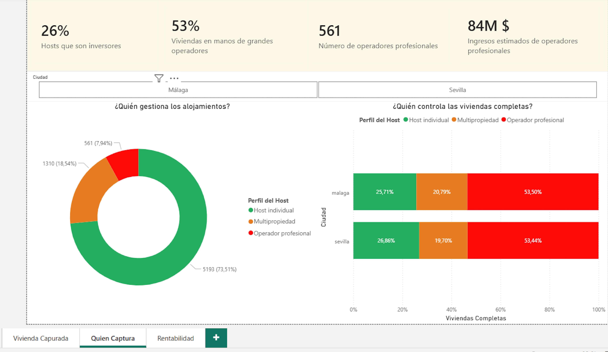
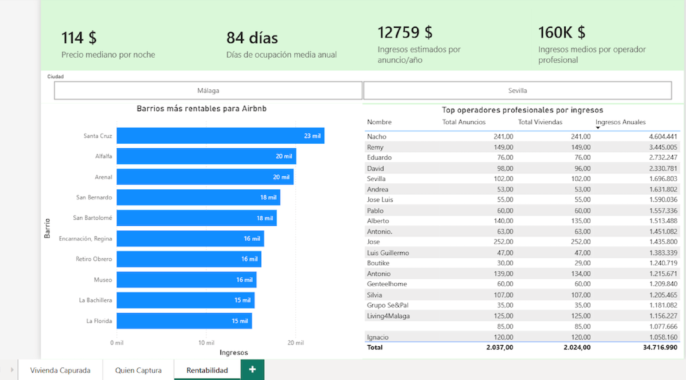

# Presión del alquiler turístico sobre el mercado residencial en España

Pipeline de data engineering que monitoriza el impacto de Airbnb sobre el mercado
de vivienda en las **9 ciudades españolas** disponibles en Inside Airbnb, con
actualización trimestral documentada y dashboard público.

---

## La pregunta

> *¿Está Airbnb presionando el mercado de vivienda en España?*
> *Medido desde tres ángulos: cuánta vivienda está siendo capturada,*
> *quién la captura y cuánto dinero genera hacerlo.*

---

## Stack tecnológico

| Herramienta | Uso |
|---|---|
| **Inside Airbnb** | Fuente de datos — snapshots trimestrales |
| **Python** | Ingesta automatizada — descarga y carga en Snowflake |
| **Snowflake** | Data warehouse — Bronze, Silver y Gold |
| **dbt Cloud** | Transformaciones SQL, tests y documentación |
| **Streamlit** | Dashboard público interactivo |
| **GitHub** | Control de versiones — ramas dev y main |

---

## Ciudades cubiertas (9)

| Ciudad | Región | Listings aprox. |
|---|---|---|
| Madrid | Comunidad de Madrid | 25.000 |
| Málaga | Andalucía | 19.000 |
| Girona | Cataluña | 17.000 |
| Sevilla | Andalucía | 16.500 |
| Barcelona | Cataluña | 16.000 |
| Mallorca | Islas Baleares | 15.000 |
| Valencia | Comunitat Valenciana | 7.800 |
| Euskadi | País Vasco | 6.300 |
| Menorca | Islas Baleares | 3.700 |

**Total: ~126.000 listings · ~5.3M reviews**

---

## Arquitectura — Medallion Architecture

```
Inside Airbnb (CSV.gz)
        │
        ▼ ingest_spain_cities.py
┌─────────────┐
│   BRONZE    │  Dato crudo · Todo TEXT · Sin transformaciones
│             │  RAW_LISTINGS (80 col · ~126K filas)
│             │  RAW_REVIEWS  (~5.3M filas)
└──────┬──────┘
       │ dbt
       ▼
┌─────────────┐
│   SILVER    │  Dato limpio · Views · 6 modelos temáticos
│             │  Tipos casteados · Columnas calculadas
│             │  Winsorización P95 por ciudad · host_profile
└──────┬──────┘
       │ dbt
       ▼
┌─────────────┐
│    GOLD     │  Dato analítico · Tables · Esquema estrella
│             │  3 dims + 2 facts + 3 marts
│             │  Incremental · SCD Tipo 2 · Seeds
└──────┬──────┘
       │
       ▼
   Streamlit (dashboard público)
```

### Arquitectura de entornos

| Entorno | Databases Snowflake | Branch GitHub |
|---|---|---|
| DEV | AIRBNB_DEV_BRONZE / SILVER / GOLD | dev |
| PROD | AIRBNB_PROD_BRONZE / SILVER / GOLD | main |

---

## Estructura del proyecto

```
spain-airbnb-housing-pressure/
├── ingest_spain_cities.py       ← descarga + carga en Snowflake
├── export_gold.py               ← Gold (Snowflake) → Parquet local
├── streamlit_app.py             ← dashboard público
├── requirements.txt
├── LICENSE                      ← MIT (código) · datos CC BY 4.0
├── data/
│   └── gold/                    ← Parquet que consume el dashboard
├── models/
│   ├── silver/
│   │   ├── sources.yml
│   │   ├── schema.yml
│   │   ├── stg_listings__details.sql
│   │   ├── stg_listings__host.sql
│   │   ├── stg_listings__location.sql
│   │   ├── stg_listings__availability.sql
│   │   ├── stg_listings__reviews_scores.sql
│   │   └── stg_reviews.sql
│   └── gold/
│       ├── schema.yml
│       ├── dims/
│       │   ├── dim_listing.sql
│       │   ├── dim_host.sql
│       │   └── dim_neighbourhood.sql
│       ├── facts/
│       │   ├── fact_listings.sql        ← incremental
│       │   └── fact_reviews_monthly.sql
│       └── marts/
│           ├── mart_neighbourhood_pressure.sql
│           ├── mart_host_profile.sql
│           └── mart_city_comparison.sql
├── seeds/
│   └── dim_room_type.csv
├── snapshots/
│   └── dim_host_snapshot.sql            ← SCD Tipo 2
├── tests/
│   └── assert_marts_listings_consistency.sql   ← coherencia marts vs fact
├── macros/
│   └── generate_schema_name.sql
└── docs/
    └── legacy/
        └── airbnb_andalucia_BI.pbix     ← dashboard PowerBI (versión bootcamp)
```

---

## Modelado de datos

### Silver — 6 tablas temáticas (views)

| Tabla | Contenido | Columnas clave calculadas |
|---|---|---|
| `stg_listings__details` | Información del inmueble | `is_entire_home` |
| `stg_listings__host` | Información del host | `host_profile`, `host_seniority_years` |
| `stg_listings__location` | Geografía del listing | `neighbourhood_cleansed` |
| `stg_listings__availability` | Precio y disponibilidad | `price_winsorized` (P95), `estimated_revenue_adjusted`, `is_high_availability` |
| `stg_listings__reviews_scores` | Puntuaciones | `days_since_last_review` |
| `stg_reviews` | Reseñas individuales | `review_month_start` |

### Gold — Esquema estrella (tables)

```
dim_listing ──┐
dim_host ─────┼──► fact_listings (incremental)
dim_neighbourhood ─┤
dim_room_type ─┘

stg_reviews ──► fact_reviews_monthly

fact_listings ──► mart_neighbourhood_pressure
              ──► mart_host_profile
              ──► mart_city_comparison
```

### Decisiones técnicas destacadas

**Winsorización P95 por ciudad:** el campo `estimated_revenue_l365d` de Inside Airbnb
contiene outliers graves causados por precios erróneos. Se aplica winsorización al
percentil 95 **por ciudad** y se recalcula
`estimated_revenue_adjusted = price_winsorized × estimated_occupancy_l365d`.

**Carga incremental:** `fact_listings` usa `materialized='incremental'` con
`unique_key=['listing_id', 'snapshot_date']`. Solo inserta filas nuevas.

**SCD Tipo 2:** `dim_host_snapshot` rastrea cambios en `calculated_host_listings_count`
y `host_profile` entre snapshots. `dbt_valid_to IS NULL` identifica el registro actual.

**Degenerate dimensions:** `city`, `host_profile` e `is_entire_home` desnormalizadas
en `fact_listings` para evitar joins frecuentes en el dashboard.

---

## Clasificación de hosts

| Perfil | Criterio |
|---|---|
| Host individual | < 2 viviendas completas |
| Multipropiedad | 2–4 viviendas completas |
| Operador profesional | ≥ 5 viviendas completas |

---

## Cómo reproducir el proyecto

### 1. Instalar dependencias

```bash
python -m venv .venv
source .venv/bin/activate
pip install -r requirements.txt
```

### 2. Configurar credenciales

Crea un archivo `.env` en la raíz del proyecto:

```
SNOWFLAKE_ACCOUNT=tu_account
SNOWFLAKE_USER=tu_usuario
SNOWFLAKE_PASSWORD=tu_password
```

### 3. Descargar datos y cargar en Snowflake

```bash
python ingest_spain_cities.py
```

El script descarga los CSV.gz de las 9 ciudades, los sube al stage
de Snowflake y ejecuta los COPY INTO automáticamente.

### 4. Configurar Snowflake (primera vez)

```sql
CREATE WAREHOUSE AIRBNB_WH WAREHOUSE_SIZE='X-SMALL'
    AUTO_SUSPEND=60 AUTO_RESUME=TRUE INITIALLY_SUSPENDED=TRUE;

CREATE DATABASE AIRBNB_DEV_BRONZE;   CREATE DATABASE AIRBNB_PROD_BRONZE;
CREATE DATABASE AIRBNB_DEV_SILVER;   CREATE DATABASE AIRBNB_PROD_SILVER;
CREATE DATABASE AIRBNB_DEV_GOLD;     CREATE DATABASE AIRBNB_PROD_GOLD;
```

### 5. Ejecutar el pipeline dbt

```bash
dbt deps
dbt seed
dbt run
dbt snapshot
dbt test
```

### 6. Exportar Gold a Parquet y lanzar el dashboard

```bash
python3 export_gold.py
streamlit run streamlit_app.py
```

`export_gold.py` vuelca las tablas de Gold a `data/gold/*.parquet`, que es lo
que lee el dashboard (sin necesidad de que Snowflake esté activo). Por defecto
exporta desde `AIRBNB_PROD_GOLD`; para exportar desde DEV:

```bash
DBT_DATABASE_GOLD=AIRBNB_DEV_GOLD python3 export_gold.py
```

### Actualización trimestral

Cuando Inside Airbnb publica un nuevo snapshot, el ciclo completo es:
`ingest_spain_cities.py` → `dbt run` + `dbt test` → `export_gold.py` → commit de
`data/gold/`. No hay orquestador: el proceso está documentado, pero se lanza
manualmente.

---
## Limitaciones conocidas
- Precios en USD — Inside Airbnb no convierte a EUR
- Málaga tiene baja granularidad geográfica: 65,8% de listings bajo el barrio 'Centro'
- `estimated_revenue_adjusted` es una estimación, no el ingreso real del propietario
- Los snapshots de Inside Airbnb son trimestrales, no datos en tiempo real
- Inside Airbnb scrapea cada ciudad a lo largo de varios días: `last_scraped`
  tiene varias fechas dentro del mismo snapshot (Madrid: 5 fechas entre el
  2026-06-20 y el 2026-07-02). Por eso los marts filtran por una ventana de
  30 días y no por el máximo exacto

---

## Fuente de datos y atribución

Los datos proceden de **[Inside Airbnb](https://insideairbnb.com)**, un proyecto
independiente que publica datos de listings de Airbnb con fines de investigación
sobre el impacto de los alquileres turísticos en las ciudades.

Los datos de Inside Airbnb se distribuyen bajo licencia
**[Creative Commons Attribution 4.0 International (CC BY 4.0)](https://creativecommons.org/licenses/by/4.0/)**,
que permite compartir y adaptar el material siempre que se dé la atribución
correspondiente. Este proyecto no está afiliado ni respaldado por Inside Airbnb
ni por Airbnb, Inc.

## Licencia

El **código** de este repositorio (ingesta, modelos dbt y dashboard) se publica
bajo licencia **[MIT](LICENSE)**.

Los **datos** de `data/` conservan la licencia original de Inside Airbnb
(CC BY 4.0) y no están cubiertos por la licencia MIT.

---

## Dashboard PowerBI (versión bootcamp)

Primera versión del proyecto, anterior al dashboard de Streamlit. El fichero
`.pbix` se conserva en [`docs/legacy/`](docs/legacy/) como referencia histórica.

### Página 1 — ¿Cuánta vivienda está siendo capturada?

### Página 2 — ¿Quién captura la vivienda?

### Página 3 — ¿Cuál es la rentabilidad?

